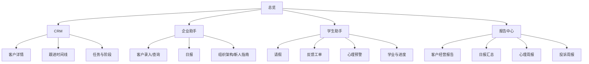

# 教育服务业务系统原型结构 v1

## 1. 原型目标

本原型先定义中低保真页面结构，用于确认产品范围和交互路径。当前阶段不追求高保真视觉，不引入新的设计系统，不启动前端开发。

原型应帮助回答三个问题：

1. 用户从哪里进入每条业务主线。
2. 每个页面展示哪些信息和动作。
3. 后续 React 可点击原型应该按什么页面顺序实现。

## 2. 设计原则

1. 工作台优先：第一屏直接进入业务总览，不做营销式首页。
2. 运营效率优先：表格、筛选、详情、时间线、快捷操作是核心。
3. AI 可解释：AI 输出必须展示来源、状态、理由或 fallback。
4. 角色清晰：员工、学生、老师、管理者、管理员看到的入口不同。
5. 可演示闭环：每个页面都能支撑一次可讲清楚的演示动作。

## 3. 全局布局

| 区域 | 内容 |
| --- | --- |
| 顶部栏 | 系统名称、当前角色、OpenAPI 入口、Dify 状态、演示数据初始化 |
| 左侧导航 | 总览、CRM、项目/课程、活动运营、企业助手、学生助手、知识库、报告中心、系统管理 |
| 主内容区 | 当前页面核心业务内容 |
| 右侧上下文区 | 当前客户、当前学生、待办、AI 调用状态、最近操作，可按页面显示 |

## 4. 信息架构

## 5. 页面原型

### 5.1 总览页

页面目标：让管理者和演示者快速说明系统覆盖范围和当前数据状态。

| 区域 | 内容 |
| --- | --- |
| 指标栏 | 今日新增线索、待跟进任务、待审批请假、待处理反馈、心理预警、最近报告 |
| 主链路卡片 | 客户增长闭环、企业助手闭环、学生服务闭环、报告决策闭环 |
| 今日待办 | CRM 跟进、请假审批、反馈处理、报告生成 |
| AI 状态 | Dify 配置状态、fallback 次数、最近问答 |
| 快捷入口 | 初始化演示数据、打开 OpenAPI、生成报告 |

核心动作：
- 点击“初始化演示数据”调用 `POST /api/demo/seed`。
- 点击任一主链路卡片跳转对应模块。
- 点击 AI 状态进入知识库日志。

### 5.2 CRM 页面

页面目标：支撑顾问管理客户从线索到签约或流失的全过程。

| 区域 | 内容 |
| --- | --- |
| 筛选区 | 关键词、状态、负责人、推荐项目、创建时间 |
| 线索列表 | 姓名、联系方式、状态、推荐项目、最近跟进、负责人、下一步任务 |
| 详情区 | 基础信息、画像研判、推荐理由、活动报名、知识问答 |
| 时间线 | 创建、画像、问答、跟进、状态变化、活动报名 |
| 操作区 | 新增跟进、创建任务、更新状态、标记成交、标记流失 |

核心动作：
- 从列表选择客户，右侧展示详情。
- 新增跟进后时间线追加记录。
- 更新状态后写入阶段历史。

### 5.3 项目/课程页面

页面目标：维护项目资料，并为画像推荐和二次转化提供基础。

| 区域 | 内容 |
| --- | --- |
| 项目列表 | 项目名称、国家、类别、费用区间、周期、标签、状态 |
| 项目详情 | 适合人群、招生条件、卖点、流程、知识来源 |
| 标签区 | 升学、就业、移民、低成本、短学制、带薪实习 |
| 推荐说明 | 命中哪些画像条件，为什么推荐该项目 |

核心动作：
- 新增或编辑项目。
- 查看项目关联的画像推荐规则。
- 从项目跳转到相关客户列表。

### 5.4 活动运营页面

页面目标：承接客户和学生运营动作。

| 区域 | 内容 |
| --- | --- |
| 活动列表 | 名称、类型、时间、地点、人数、状态 |
| 活动详情 | 适合对象、讲师、报名名单、签到情况 |
| 报名操作 | 选择线索或学生报名 |
| 签到操作 | 对报名记录进行签到 |

核心动作：
- 创建活动。
- 为线索或学生报名。
- 查看报名名单并签到。

### 5.5 企业助手页面

页面目标：为员工提供自然语言业务入口。

| 区域 | 内容 |
| --- | --- |
| 对话区 | 员工输入、助手回复、意图、执行状态 |
| 快捷指令 | 录入客户、查询客户、更新状态、提交日报、查询组织架构 |
| 业务结果区 | 创建的客户、查询结果、日报结构化结果、组织信息 |
| 日报区 | 今日日报、历史日报、汇总入口 |
| NL2SQL 区 | 受控查询输入、白名单说明、查询结果 |

核心动作：
- 输入“帮我录入一个客户……”后创建线索。
- 输入“提交今天日报……”后生成日报记录。
- 输入“查一下双元制事业部负责人”后返回组织架构或知识库答案。

### 5.6 学生助手页面

页面目标：为学生提供服务自助入口，为老师提供跟进闭环。

| 区域 | 内容 |
| --- | --- |
| 学生选择 | 当前学生、项目、顾问/老师、状态 |
| 对话区 | 学生问题、助手回复、意图和状态 |
| 服务卡片 | 请假申请、反馈工单、申请进度、学业节点、生活支持 |
| 老师处理区 | 待审批请假、待处理反馈、心理预警 |
| 风险提示 | 风险等级、触发原因、跟进状态 |

核心动作：
- 学生提交请假申请。
- 老师审批请假。
- 学生提交反馈工单。
- 系统记录心理预警，老师跟进后关闭。

### 5.7 知识库页面

页面目标：展示 Dify 知识问答能力、来源和 fallback 状态。

| 区域 | 内容 |
| --- | --- |
| 问答入口 | 场景选择、问题输入、客户/学生上下文 |
| 答案区 | 回答、引用来源、调用状态、conversation id |
| 知识来源 | 公司信息、公司业务、留学政策、新人指南、海外生活 |
| 同步任务 | 来源、任务类型、状态、错误信息、完成时间 |
| 日志列表 | 问题、状态、时间、详情 |

核心动作：
- 按场景提问。
- 查看引用来源。
- 创建知识同步任务记录。

### 5.8 报告中心页面

页面目标：生成和查看管理报告。

| 区域 | 内容 |
| --- | --- |
| 报告类型 | 客户经营、员工日报、心理健康、投诉处理 |
| 生成参数 | 时间范围、部门、项目、生成方式 |
| 报告列表 | 标题、类型、周期、生成方式、生成时间 |
| 报告详情 | 关键指标、结构化结论、风险提示、建议动作 |

核心动作：
- 选择报告类型并生成。
- 查看报告详情。
- 从报告跳转到相关客户、员工、学生或工单。

### 5.9 系统管理页面

页面目标：提供企业级交付基础治理。

| 区域 | 内容 |
| --- | --- |
| 用户管理 | 用户名、姓名、类型、状态、角色 |
| 角色管理 | 角色编码、角色名称、权限点 |
| 权限点 | 模块、权限编码、说明 |
| 审计日志 | 操作人、动作、资源、详情、时间 |
| 通知中心 | 接收人、标题、状态、关联资源 |

核心动作：
- 创建角色并分配权限。
- 查看关键操作审计。
- 查看通知和待办状态。

## 6. 角色视图

| 角色 | 默认首页 | 可见重点 |
| --- | --- | --- |
| 管理员 | 系统管理 | 用户、角色、权限、审计、全部模块 |
| 管理者 | 总览 | 报告、日报汇总、客户漏斗、风险预警 |
| 顾问 | CRM | 线索、跟进、项目推荐、活动报名 |
| 员工 | 企业助手 | 日报、客户录入、组织架构、新人指南 |
| 老师 | 学生助手 | 请假审批、反馈处理、心理预警、学业节点 |
| 学生 | 学生助手 | 请假、反馈、进度、生活支持 |

## 7. 演示路径

### 7.1 客户增长演示

1. 总览页初始化演示数据。
2. CRM 新增客户或从画像页保存线索。
3. 查看画像推荐和项目命中理由。
4. 新增跟进记录并创建任务。
5. 为客户报名活动。
6. 生成客户经营报告。

### 7.2 企业助手演示

1. 打开企业助手。
2. 输入自然语言客户录入指令。
3. 系统创建线索并展示结果。
4. 输入日报口述内容。
5. 系统生成结构化日报。
6. 管理者查看日报汇总报告。

### 7.3 学生助手演示

1. 打开学生助手。
2. 学生提交请假申请。
3. 老师审批请假。
4. 学生提交反馈工单。
5. 系统生成心理风险辅助提示。
6. 生成学生心理健康周报或投诉处理周报。

### 7.4 企业级治理演示

1. 管理员查看角色权限。
2. 执行一次关键业务操作。
3. 查看审计日志。
4. 查看 Dify fallback 或知识来源状态。

## 8. 可点击原型建议

如果下一步做 React 可点击原型，建议先做以下页面：

1. 总览页
2. CRM 页面
3. 企业助手页面
4. 学生助手页面
5. 报告中心页面
6. 系统管理页面

第一版可点击原型不需要实现所有真实 API，可采用“真实 API + mock 数据混合”的方式：

- 一期已有链路继续调用真实 API。
- 二期未完成接口先用本地 mock 数据。
- UI 状态包括 loading、success、fallback、empty、error。

## 9. 原型验收标准

1. 用户能从总览页理解系统的四条主线。
2. 每个核心页面都有明确的主操作。
3. 客户、员工、学生、管理者、管理员的入口差异清晰。
4. AI 输出区域能看到状态、来源或理由。
5. 原型能直接指导后续 React 页面拆分和 API 对接。
