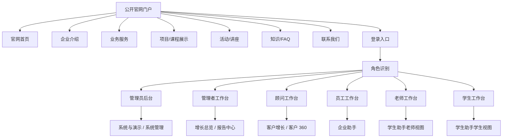

# 教育服务业务系统原型结构 v1

## 1. 原型目标

本原型定义二期前端的信息架构和中低保真页面结构，用于指导后续 React 可点击原型和代码实现。

系统入口不再直接进入后台工作台，而是采用真实企业级产品结构：

```text
公开官网门户 -> 登录入口 -> 按角色进入后台生产力工具
```

公开官网用于面向陌生游客、潜在客户、家长、学生和合作方展示企业背景、业务服务、项目活动和咨询入口。登录后后台才承载当前已规划的客户增长流水线、客户 360、企业助手、学生助手、报告中心和系统治理。

原型应帮助回答五个问题：

1. 未登录用户如何了解企业和业务。
2. 官网如何引导咨询、活动报名和登录。
3. 登录后不同角色分别进入哪个后台工作台。
4. 单个客户的画像、推荐、咨询、跟进、活动和报告如何在客户 360 中组织。
5. 后续 React 可点击原型应该按什么页面顺序实现。

## 2. 设计原则

1. 官网先行：未登录首屏必须是企业官网门户，不直接暴露后台工作台。
2. 登录分层：登录页连接官网与后台，当前阶段可用演示账号或角色选择，V2 再补真实认证。
3. 角色进入：管理员、管理者、顾问、员工、老师、学生登录后进入不同默认工作台。
4. 后台主链路优先：登录后后台继续采用“客户增长流水线 + 客户 360 工作台”结构。
5. 内外数据隔离：官网不展示 CRM 客户、审计、学生心理预警、员工日报、权限矩阵等内部数据。
6. AI 可解释：公开 FAQ 和后台 AI 输出都必须展示来源、状态、理由或 fallback。
7. 可演示闭环：每个页面都应支撑一个清楚的真实业务动作，不为答辩展示牺牲产品结构。
8. 信任与转化优先：官网首页先建立企业可信度和服务清晰度，再引导咨询、项目查看、活动报名和后台登录。

## 3. 总体信息架构



## 4. 公开官网门户

### 4.1 官网目标

官网负责获客和信任建立，应让陌生用户快速理解：

1. 公司是谁。
2. 提供哪些教育服务。
3. 适合哪些学生或家庭。
4. 有哪些项目、课程、活动和成功路径。
5. 如何咨询、报名或登录。

### 4.2 官网全局布局

| 区域 | 内容 |
| --- | --- |
| 顶部导航 | 企业 Logo、首页、企业介绍、业务服务、项目/课程、活动/讲座、知识 FAQ、联系我们、登录 |
| 首页首屏 | 企业定位、服务对象、核心价值、咨询 CTA、登录入口 |
| 主内容区 | 当前公开页面内容 |
| 页脚 | 联系方式、地址、业务范围、咨询渠道、备案/版权占位 |

### 4.3 官网页面原型

#### 4.3.1 官网首页

| 区域 | 内容 |
| --- | --- |
| 首屏 | 企业定位、服务对象、核心承诺、咨询 CTA、登录后台入口 |
| 核心业务 | 留学规划、国际本科、德国双元制、语言培训、背景提升 |
| 为什么选择我们 | 规划能力、项目资源、顾问/老师能力、学生服务、智能化运营 |
| 热门项目 | 对外可见项目摘要和咨询入口 |
| 近期活动 | 公开讲座、时间、适合对象、报名入口 |
| FAQ 摘要 | 高频问题和 Dify/fallback 状态 |
| 联系转化 | 电话、微信、咨询表单入口 |

核心动作：

- 点击“立即咨询”进入联系表单。
- 点击“查看项目”进入项目/课程展示。
- 点击“活动报名”进入活动详情。
- 点击“登录”进入登录页。

首页不得把后台 CRM、客户 360、系统管理、OpenAPI 或演示控制做成首屏功能卡片。内部能力只可转译为游客可理解的服务结果，例如“项目匹配建议”“申请进度可追踪”“学生服务闭环”。

#### 4.3.2 企业介绍

| 区域 | 内容 |
| --- | --- |
| 公司背景 | 企业简介、服务理念、业务覆盖 |
| 团队/资质 | 顾问、老师、项目资源、服务经验 |
| 服务流程 | 咨询、评估、规划、申请、行前和在读服务 |

#### 4.3.3 业务服务

| 服务 | 内容 |
| --- | --- |
| 留学规划 | 背景评估、路径设计、申请节奏 |
| 国际本科 | 新加坡等项目路径、适合人群、升学目标 |
| 德国双元制 | 就业导向、带薪实习、语言要求 |
| 语言培训 | 语言基础、考试准备、衔接课程 |
| 背景提升 | 竞赛、科研、文书素材和规划 |
| 学生服务 | 请假、反馈、进度、生活支持等后续服务说明 |

#### 4.3.4 项目/课程展示

公开展示项目摘要，不展示内部推荐分数和 CRM 数据。

| 区域 | 内容 |
| --- | --- |
| 项目列表 | 名称、国家、类别、适合人群、费用区间、周期 |
| 项目详情 | 升学路径、招生条件、服务内容、咨询入口 |
| 关联活动 | 可报名讲座或说明会 |

#### 4.3.5 活动/讲座

| 区域 | 内容 |
| --- | --- |
| 活动列表 | 名称、时间、形式、适合对象、报名状态 |
| 活动详情 | 主题、讲师、适合人群、报名入口 |
| 报名表单 | 姓名、联系方式、意向项目、备注 |

#### 4.3.6 知识/FAQ

| 区域 | 内容 |
| --- | --- |
| FAQ 分类 | 公司业务、留学政策、项目费用、申请材料、学生服务 |
| 问答入口 | 公开问题输入 |
| 答案区 | Dify 答案、引用来源、fallback 原因 |

#### 4.3.7 联系我们

| 区域 | 内容 |
| --- | --- |
| 联系方式 | 电话、微信、地址、办公时间 |
| 咨询表单 | 姓名、联系方式、关注项目、问题描述 |
| 后续流转 | 表单提交后可进入 CRM 线索池 |

### 4.4 官网禁止展示内容

官网不得展示：

1. CRM 客户列表。
2. 客户 360。
3. 员工日报。
4. 学生心理预警明细。
5. 审计日志。
6. 角色权限矩阵。
7. OpenAPI、seed、接口健康。
8. 内部 fallback JSON 或调试信息。

## 5. 登录入口

### 5.1 登录页目标

登录页连接公开官网和后台生产力工具。

当前阶段可先实现：

- 演示账号。
- 角色选择。
- 登录后跳转对应后台入口。

页面必须明确：生产级账号密码、Token、会话管理和后端权限校验属于 V2 增强。

### 5.2 登录后跳转

| 角色 | 默认入口 | 说明 |
| --- | --- | --- |
| 管理员 | 系统与演示 / 系统管理 | 管理用户、角色、权限、审计、通知和演示控制 |
| 管理者 | 增长总览 | 查看经营状态、客户漏斗、报告和风险 |
| 顾问 | 客户增长 | 管理客户列表、客户 360、跟进、任务、活动报名 |
| 员工 | 企业助手 | 客户录入、日报、组织架构、新人指南和受控查询 |
| 老师 | 学生助手老师视图 | 请假审批、反馈处理、心理辅助预警、学生进度 |
| 学生 | 学生助手学生视图 | 请假、反馈、查进度、学业节点和生活支持 |

## 6. 登录后后台生产力工具

登录后后台沿用“客户增长流水线 + 客户 360 工作台”，但它不再是系统未登录首屏。

后台一级入口：

| 入口 | 定位 | 主要角色 |
| --- | --- | --- |
| 增长总览 | 今日重点、最近客户、待办、经营状态 | 管理者、顾问、管理员 |
| 客户增长 | CRM 流水线、客户列表、阶段推进 | 顾问、管理者、管理员 |
| 客户 360 | 单个客户画像、推荐、咨询、跟进、活动、报告 | 顾问、管理者、管理员 |
| 运营资源 | 项目/课程、活动、知识库 | 顾问、运营、管理员 |
| 报告中心 | 客户经营、日报、心理、投诉报告 | 管理者、管理员、老师 |
| 二期助手 | 企业助手、学生助手 | 员工、老师、学生、管理员 |
| 系统与演示 | 用户角色、权限、审计、通知、OpenAPI、seed、fallback | 管理员、部分管理者只读 |

### 6.1 增长总览

| 区域 | 内容 |
| --- | --- |
| 指标栏 | 今日新增、高潜客户、待跟进、活动转化、最近报告 |
| 今日重点 | 需要今天处理的高潜客户、超时跟进、活动邀约 |
| 最近客户 | 最近被创建、咨询、画像或跟进的客户 |
| 待办 | CRM 跟进、活动确认、报告生成等客户增长任务 |

### 6.2 客户增长

| 区域 | 内容 |
| --- | --- |
| 阶段漏斗 | 新线索、已画像、咨询中、活动邀约、成交/流失 |
| 筛选区 | 关键词、阶段、负责人、推荐项目、创建时间 |
| 客户列表 | 客户、阶段、推荐项目、负责人、最近跟进、下一步动作 |
| 详情入口 | 点击客户进入客户 360 |

### 6.3 客户 360

内部 tabs：

| Tab | 内容 |
| --- | --- |
| 客户概览 | 基础信息、当前阶段、最近跟进、关键缺口、下一步动作 |
| 画像研判 | 结构化画像、匹配分、命中规则、缺失字段、风险提示 |
| 推荐项目 | 推荐项目、命中标签、推荐理由、项目详情入口 |
| 咨询记录 | Dify 问答、引用来源、fallback 状态、conversation id |
| 跟进任务 | 跟进记录、待办任务、完成状态、阶段历史、成交/流失动作 |
| 活动报名 | 推荐活动、报名记录、名单状态、签到结果 |
| 报告快照 | 客户相关报告摘要、经营建议、历史快照 |

右侧 AI 建议 / 下一步动作面板只在客户 360 内出现，并可收起。

### 6.4 运营资源

| 入口 | 内容 |
| --- | --- |
| 项目/课程 | 项目资料、标签、适合人群、费用周期、招生条件、推荐规则 |
| 活动运营 | 活动创建、报名名单、签到、线索/学生两类主体 |
| 知识库 | Dify 知识来源、同步任务、按场景问答日志、fallback 状态 |

### 6.5 报告中心

| 区域 | 内容 |
| --- | --- |
| 报告类型 | 客户经营、员工日报、心理健康、投诉处理 |
| 生成参数 | 时间范围、部门、项目、生成方式 |
| 报告列表 | 标题、类型、周期、生成方式、生成时间 |
| 报告详情 | 关键指标、结构化结论、风险提示、建议动作 |

### 6.6 二期助手

企业助手：

- 客户自然语言录入/查询/状态更新。
- 口述日报和日报汇总。
- 组织架构和新人指南。
- 受控 NL2SQL。

学生助手：

- 请假申请与审批。
- 售后反馈。
- 心理辅助预警。
- 学业考务。
- 申请进度。
- 生活支持。
- 二次转化推荐。

### 6.7 系统与演示

| 区域 | 内容 |
| --- | --- |
| 用户角色 | 用户、角色、权限点、角色权限绑定 |
| 审计通知 | 审计日志、通知中心 |
| 演示控制 | OpenAPI、初始化演示数据、接口健康 |
| AI 状态 | Dify 配置、fallback 记录、知识库同步状态 |
| phase2 状态 | `/api/phase2/overview` 计数和模块状态 |

## 7. 角色视图

当前阶段采用“前端角色视图 + 后端权限数据展示”，不假装完整登录鉴权已经完成。

| 角色 | 默认入口 | 可见入口 |
| --- | --- | --- |
| 未登录游客 | 官网首页 | 官网首页、企业介绍、业务服务、项目/课程展示、活动/讲座、知识/FAQ、联系我们、登录 |
| 管理员 | 系统与演示或增长总览 | 全部后台入口 |
| 管理者 | 增长总览 | 增长总览、客户增长、报告中心、二期助手部分管理视图、系统与演示只读治理视图 |
| 顾问 | 客户增长 | 增长总览、客户增长、客户 360、运营资源、报告中心客户经营报告 |
| 员工 | 企业助手 | 企业助手、知识库、有限客户结果入口 |
| 老师 | 学生助手 | 学生助手、学生相关报告、知识库 |
| 学生 | 学生助手 | 学生助手、生活支持问答 |

## 8. 可点击原型建议

后续 React 可点击原型建议按以下顺序实现：

1. 公开官网门户壳层。
2. 官网首页。
3. 登录页和角色跳转。
4. 登录后后台壳层。
5. 增长总览。
6. 客户增长。
7. 客户 360。
8. 运营资源。
9. 报告中心。
10. 二期助手。
11. 系统与演示。

第一版可点击原型应优先接入已存在真实 API；后端不可用时可保留明确 fallback 或 empty 状态。

## 9. 原型验收标准

1. 未登录用户看到的是企业官网，不是后台工作台。
2. 官网能说明企业背景、业务服务、项目活动和咨询入口。
3. 登录页能按角色进入对应后台入口。
4. CRM / 客户增长是顾问和管理者的后台主入口。
5. 用户能从客户列表进入客户 360，并完成客户增长主链路演示。
6. 企业助手、学生助手不与客户增长主链路抢首屏，但登录后可按角色直接进入。
7. OpenAPI、seed、fallback 状态进入系统与演示区域。
8. 官网不展示内部运营数据。
9. 原型能直接指导后续 React 页面拆分和 API 对接。
