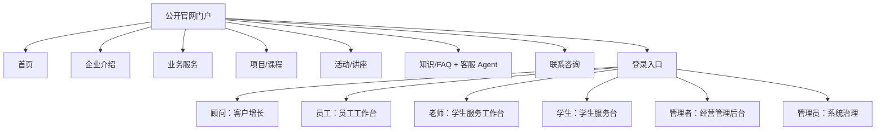

# 教育服务业务系统原型结构 v1

## 1. 原型目标

本原型定义最终版前端信息架构和页面结构。系统不再按“一期/二期”或“二期助手”组织入口，而是按客户需求表中的业务需求、真实角色权限和任务闭环组织。

入口结构：

```text
公开官网门户 -> 登录入口 -> 按权限进入对应业务后台
```

原型必须回答：

1. 游客如何了解公司、业务、政策、项目、活动并发起咨询。
2. 顾问如何手动录入客户线索并推进客户增长。
3. 员工如何提交日报、查询组织和快捷处理客户。
4. 老师如何处理学生请假、反馈、心理辅助预警和学业进度。
5. 学生如何自助提交请假、反馈和查询进度。
6. 管理者如何看经营、日报、心理和投诉报告。
7. 管理员如何治理用户、权限、审计、知识来源和系统状态；测试账号如何在验收和演示时切换角色视角。

## 2. 设计原则

1. 官网先行：未登录首屏必须是企业官网门户。
2. 角色真实：登录后按实际权限展示功能，不显示无权限入口。
3. 不使用“二期助手”：企业智能能力拆到员工工作台、客户增长和学生服务；学生智能能力拆到学生服务台和老师学生服务工作台。
4. 不套统一工作台：各角色按功能数量和使用频率排布，只保持整体风格一致。
5. 文案极简：删除解释性长文，只保留必要标题、字段、按钮、状态、错误、风险和空状态。
6. 顾问必须能手动录入客户线索，这是客户增长主操作，不得隐藏到其他角色或系统演示中。
7. 官网不得展示 CRM 客户、客户 360、员工日报、学生心理预警明细、审计日志、权限矩阵、OpenAPI、seed、接口健康等内部信息。
8. UI 效果图阶段至少输出 3 套整体风格方案；用户确认最终风格后再进入实现。
9. 每个登录角色必须有默认工作台总览页；总览页展示核心指标、待办、最近记录和功能入口，但不强行套统一模板。
10. 总览页功能卡片和侧边栏导航必须进入同一套功能状态；进入功能区后必须呈现完整页面，而不是只停留在总览卡片。

## 3. 总体信息架构



## 4. 公开官网门户

### 4.1 页面

| 页面 | 内容 | 主操作 |
| --- | --- | --- |
| 首页 | 企业定位、核心业务、热门项目、近期活动、咨询入口 | 咨询、查看项目、活动报名、登录 |
| 企业介绍 | 公司背景、使命、联系方式、主营业务 | 咨询 |
| 业务服务 | 国际教育、智慧教育、素质教育、实体教育和学生服务说明 | 查看项目 |
| 项目/课程 | 德国双元制、新加坡本硕升学等公开项目 | 咨询项目 |
| 活动/讲座 | 公开讲座、说明会、招生官见面会 | 报名 |
| 知识/FAQ | 公司、业务、政策、费用、流程问答 | 提问 |
| 联系咨询 | 表单、电话、邮箱、地址 | 提交咨询 |

### 4.2 客服 Agent

官网客服 Agent 覆盖：

- 公司信息咨询。
- 公司业务查询。
- 海外留学政策查询。
- 课程与项目推荐。
- 活动与讲座报名。
- 常见问题自助解答。
- 日常轻量闲聊。

客服 Agent 不展示内部客户列表、研判分数、CRM 阶段、员工日报、学生风险明细或系统治理信息。

## 5. 登录入口

登录页连接官网与后台。当前采用账号密码主登录，下方保留三个快捷入口：企业版、学生版、测试账号。快捷入口只填入账号密码，不直接决定权限；进入后台后的权限由账号绑定角色决定。

| 账号类型 | 默认入口 | 说明 |
| --- | --- | --- |
| 企业版快捷入口 | 客户增长 | 方便企业内部人员进入顾问/员工等业务后台，实际权限仍看账号 |
| 学生版快捷入口 | 学生服务台 | 面向学生自助服务 |
| 测试账号 | 工作台总览 | 拥有全权限，用于验收和演示，可在后台右上角切换演示视角 |
| 管理员账号 | 系统治理 | 只承担用户、角色、权限、审计、通知、知识来源和系统状态治理 |

普通账号登录后不显示演示视角切换；测试账号的演示视角切换只服务验收和演示，上线前应移除或关闭。

## 6. 登录后台页面结构

### 6.0 工作台总览导航标准

每个角色进入后台后，默认看到自己的总览工作台。总览页用于“看今天要处理什么、从哪里进入处理、最近有什么变化”，不是营销式首页，也不是静态功能陈列。

| 角色 | 默认总览 | 总览可进入功能 |
| --- | --- | --- |
| 顾问 | 客户增长工作台 | 新建线索、线索队列、漏斗阶段、客户 360、跟进任务、活动邀约 |
| 员工 | 员工工作台 | 快捷录入、日报/周报、组织架构、客户查询、新人指南 |
| 老师 | 学生服务工作台 | 请假审批、反馈处理、心理预警、学业/进度、成绩录入 |
| 学生 | 学生服务台 | 请假申请、反馈提交、成绩查询、申请进度、考务节点、生活支持 |
| 管理者 | 经营管理后台 | 增长总览、日报汇总、心理周报、投诉周报、风险队列 |
| 管理员 | 系统治理 | 用户、角色、权限、审计、通知、知识来源、系统状态 |

功能区最低布局：

| 区域 | 要求 |
| --- | --- |
| 顶部 | 功能标题、当前状态、刷新或主要操作 |
| 指标 | 与当前功能相关的数量、待处理、风险或结果 |
| 筛选 | 搜索、筛选、分组或标签，必须影响列表结果 |
| 列表 | 真实数据列表，支持选中或进入详情 |
| 详情 | 当前选中对象的业务详情和状态 |
| 操作 | 创建、编辑、审批、处理、归档等与权限匹配的动作 |
| 记录 | 时间线、处理记录、审批记录或审计摘要 |
| 状态 | 加载、空状态、错误状态和操作反馈 |

### 6.1 顾问：客户增长

目标：从线索创建到客户 360 跟进闭环。

页面结构：

| 区域 | 内容 |
| --- | --- |
| 顶部主操作 | 新建线索、上传资料、粘贴资料、触发研判 |
| 漏斗/队列 | 新线索、已研判、咨询中、活动邀约、成交、流失 |
| 客户列表 | 客户、阶段、推荐项目、负责人、最近跟进、下一步 |
| 侧栏或详情抽屉 | 快速跟进、创建任务、更新阶段 |
| 客户 360 | 画像研判、推荐项目、咨询记录、跟进任务、活动报名、报告快照 |

必须有 `新建线索` 主按钮。

### 6.2 员工：员工工作台

目标：快捷完成低成本内部操作。

页面结构：

| 区域 | 内容 |
| --- | --- |
| 快捷操作 | 录入客户、查询客户、更新状态、提交日报 |
| 日报 | 今日日报、历史日报、语音/文本输入 |
| 组织信息 | 部门、联系人、职责 |
| 新人指南 | 制度问答、流程问答 |
| 受控查询 | 只读白名单查询记录 |

### 6.3 老师：学生服务工作台

目标：处理学生服务待办。

页面结构：

| 区域 | 内容 |
| --- | --- |
| 待办队列 | 请假待审批、反馈待处理、心理辅助预警待跟进 |
| 请假审批 | 申请详情、同意、拒绝、审批记录 |
| 反馈工单 | 内容摘要、状态、解决方案、通知学生 |
| 心理辅助预警 | 风险等级、触发原因、跟进状态 |
| 学业/进度 | 考务节点、申请进度 |

### 6.4 学生：学生服务台

目标：自助提交和查询服务。

页面结构：

| 区域 | 内容 |
| --- | --- |
| 服务入口 | 请假申请、投诉建议、申请进度、考务节点、生活支持 |
| 我的事项 | 请假状态、反馈状态、进度状态 |
| 生活支持 | 海外医疗、交通、紧急求助等问答 |
| 心理倾诉 | 情绪表达入口，文案仅提示辅助识别不替代专业诊断 |
| 推荐项目 | 升学项目推荐，必须标注为推荐 |

### 6.5 管理者：经营管理后台

目标：看经营和风险。

页面结构：

| 区域 | 内容 |
| --- | --- |
| 指标总览 | 新增线索、成交、流失、待跟进、投诉、心理预警 |
| 报告入口 | 客户经营、日报汇总、心理健康周报、投诉周报 |
| 团队日报 | 日报日/周汇总 |
| 风险队列 | 流失风险、投诉超时、心理高风险 |

### 6.6 管理员：系统治理

目标：维护系统基础配置和演示治理。

页面结构：

| 区域 | 内容 |
| --- | --- |
| 用户角色 | 用户、角色、权限、绑定 |
| 审计通知 | 审计日志、通知中心 |
| 知识来源 | 公司信息、业务、政策、新人指南、生活支持 |
| 演示控制 | OpenAPI、seed、接口状态 |
| AI 状态 | Dify、fallback、同步记录 |

## 7. 角色任务完整性排查

每个角色原型必须通过以下排查：

| 检查项 | 要求 |
| --- | --- |
| 是否需要创建数据 | 顾问创建线索，学生提交请假，员工提交日报等必须有入口 |
| 是否需要查看数据 | 老师查看学生事项，管理者查看报告等必须有入口 |
| 是否需要更新状态 | 顾问更新客户阶段，老师审批请假，员工更新客户状态等必须有入口 |
| 是否需要处理待办 | 投诉、请假、心理预警、跟进任务必须有队列 |
| 是否需要报表 | 管理者和老师有对应报告入口 |
| 是否有数据库表 | 每个动作对应表或读模型 |
| 是否有 API | 页面不能只是静态展示 |
| 是否有前端入口 | 需求不能只存在文档中 |

## 8. 交互闭环验收标准

| 交互类型 | 验收要求 |
| --- | --- |
| 刷新和返回 | 刷新后保持当前公开页、角色后台、业务模块和关键对象位置 |
| 搜索筛选 | 输入关键词或选择筛选条件后，列表、数量和空状态必须同步变化 |
| 漏斗节点 | 点击阶段节点后必须筛选或刷新对应列表，不得只作为展示图形 |
| 列表项 | 点击后进入详情、选中对象或打开处理面板 |
| 表单提交 | 成功后必须能在对应列表或详情中看到新记录 |
| 审批处理 | 处理后必须显示新状态、处理人、处理时间和处理记录 |
| 多角色回显 | 发起方提交后，处理方可见；处理方更新后，发起方可见 |
| 不可用能力 | 暂不可用时必须说明业务原因或替代路径，不展示内部技术状态 |
| 总览卡片 | 点击后进入对应功能区，并与侧边栏入口保持同一状态 |
| 功能区布局 | 每个功能区必须有真实数据、列表、详情、操作和反馈，不得只有静态概览 |

## 9. 原型验收标准

1. 官网默认首屏可面向游客使用。
2. 客服 Agent 覆盖客户需求表中的 7 类公开咨询场景。
3. 顾问有手动录入客户线索入口。
4. 员工、老师、学生分别进入自己的业务页面，不再进入“二期助手”。
5. 无权限入口直接不展示。
6. 页面解释性文字已精简。
7. 不出现大面积空白和长列表堆叠。
8. 每个客户需求表细分项都能追踪到页面、API 和数据库表。
9. 已输出至少 3 套 UI 风格效果图，并由用户确认最终方向。
10. 核心业务对象通过交互闭环验收，不存在只展示、不跳转、不筛选、不落库的假交互。
11. 每个角色默认工作台可作为总览导航页使用，总览卡片和侧边栏均可进入对应功能区。
12. 每个功能区通过完整布局验收，包含真实数据、列表/详情、操作入口、处理记录和状态反馈。
