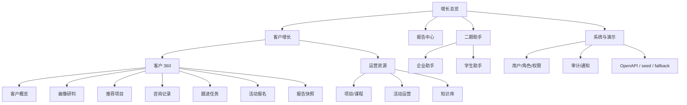

# 教育服务业务系统原型结构 v1

## 1. 原型目标

本原型定义二期前端的信息架构和中低保真页面结构，用于指导后续 React 可点击原型和代码实现。

当前前端不再按“功能模块陈列”组织，而是采用“客户增长流水线 + 客户 360 工作台”结构。系统仍覆盖 CRM、项目/课程、活动、企业助手、学生助手、知识库、报告、系统管理等二期能力，但首屏和主入口必须围绕客户增长闭环推进。

原型应帮助回答四个问题：

1. 用户从哪里进入客户增长主链路。
2. 单个客户的画像、推荐、咨询、跟进、活动和报告如何在客户 360 中组织。
3. 企业助手、学生助手、系统管理和演示控制台如何作为扩展入口呈现。
4. 后续 React 可点击原型应该按什么页面顺序实现。

## 2. 设计原则

1. 主链路优先：首页直接进入增长总览，不做营销式首页，也不陈列全部功能。
2. CRM 主入口：客户列表和客户流水线是业务推进入口，不只是普通模块。
3. 客户 360 承接复杂度：围绕单个客户组织画像、推荐、Dify 咨询、跟进、活动和报告。
4. 扩展能力分层：企业助手、学生助手作为二期助手入口；系统管理和 demo 控件进入系统与演示区域。
5. AI 可解释：AI 输出必须展示来源、状态、理由或 fallback。
6. 角色清晰：不同角色看到不同入口；无权限入口隐藏，页面内动作可禁用或只读。
7. 可演示闭环：每个页面都应支撑一个清楚的演示动作，不为展示功能牺牲业务流程清晰度。

## 3. 全局布局

| 区域 | 内容 |
| --- | --- |
| 顶部栏 | 系统名称、当前角色视图、关键全局动作；不常驻 OpenAPI、seed 和完整 fallback 状态 |
| 左侧导航 | 增长总览、客户增长、运营资源、报告中心、二期助手、系统与演示 |
| 主内容区 | 当前业务页面的核心任务 |
| 客户上下文区 | 只在客户 360 内出现，可收起，展示 AI 建议、下一步动作、风险和缺失信息 |
| 系统与演示区 | OpenAPI、初始化演示数据、fallback 状态、接口健康、权限审计 |

不再使用全局常驻右侧上下文面板承载当前客户、当前学生、待办、AI 状态和最近操作。跨模块上下文应进入具体页面或可收起抽屉。

## 4. 信息架构

一级入口说明：

| 一级入口 | 定位 | 包含内容 |
| --- | --- | --- |
| 增长总览 | 首页，回答今天该推进什么 | 增长指标、今日重点、最近客户、待办、最近报告摘要 |
| 客户增长 | CRM 主入口 | 客户列表、阶段漏斗、负责人、下一步动作、客户 360 入口 |
| 运营资源 | 支撑客户增长 | 项目/课程、活动运营、知识库来源和日志 |
| 报告中心 | 管理决策 | 客户经营、员工日报、学生心理健康、投诉处理报告 |
| 二期助手 | 扩展业务入口 | 企业助手、学生助手 |
| 系统与演示 | 治理和演示控制 | 用户角色、权限点、审计、通知、OpenAPI、seed、fallback |

客户 360 不作为普通一级导航，由客户列表、最近客户、待办、报告关联客户等入口进入。

## 5. 页面原型

### 5.1 增长总览

页面目标：让管理者、顾问和演示者快速看到客户增长状态和今日重点。

| 区域 | 内容 |
| --- | --- |
| 指标栏 | 今日新增、高潜客户、待跟进、活动转化、最近报告 |
| 今日重点 | 需要今天处理的高潜客户、超时跟进、活动邀约 |
| 最近客户 | 最近被创建、咨询、画像或跟进的客户 |
| 待办 | CRM 跟进、活动确认、报告生成等客户增长相关任务 |
| 轻量状态 | Dify/fallback/接口状态摘要，详细信息进入系统与演示 |

核心动作：

- 点击今日重点进入对应客户 360。
- 点击最近客户进入客户 360。
- 点击客户增长进入客户流水线。
- 点击系统状态进入系统与演示。

禁止事项：

- 不在首页平铺企业助手、学生助手、系统管理完整内容。
- 不在首页常驻 OpenAPI、初始化演示数据、完整 fallback JSON。

### 5.2 客户增长

页面目标：支撑顾问从客户队列推进转化。

| 区域 | 内容 |
| --- | --- |
| 阶段漏斗 | 新线索、已画像、咨询中、活动邀约、成交/流失 |
| 筛选区 | 关键词、阶段、负责人、推荐项目、创建时间 |
| 客户列表 | 客户、阶段、推荐项目、负责人、最近跟进、下一步动作 |
| 批量视图 | 高潜、超时、活动待邀约、长期培育 |
| 详情入口 | 点击客户进入客户 360 |

核心动作：

- 从列表进入客户 360。
- 根据阶段、负责人和推荐项目筛选客户。
- 新建客户或从企业助手创建结果跳入客户列表。

该页面只做队列管理，不承载完整客户详情。

### 5.3 客户 360

页面目标：围绕单个客户组织所有客户增长动作。

顶部信息：

- 客户姓名、联系方式、当前阶段、负责人、推荐项目。
- 快捷动作：新增跟进、创建任务、报名活动、生成报告快照。

内部 tabs：

| Tab | 内容 |
| --- | --- |
| 客户概览 | 基础信息、当前阶段、最近跟进、关键缺口、下一步动作 |
| 画像研判 | 结构化画像、匹配分、命中规则、缺失字段、风险提示 |
| 推荐项目 | 推荐项目、命中标签、推荐理由、项目详情入口 |
| 咨询记录 | Dify 问答、引用来源、fallback 状态、conversation id |
| 跟进任务 | 跟进记录、待办任务、完成状态、阶段历史、成交/流失动作 |
| 活动报名 | 推荐活动、报名记录、名单状态、签到结果 |
| 报告快照 | 客户相关报告摘要、经营建议、历史快照 |

右侧可收起面板：

| 区域 | 内容 |
| --- | --- |
| AI 建议 | 下一步动作、话术建议、风险提示 |
| 缺失信息 | 预算、语言基础、申请时间、家庭决策人等 |
| 操作入口 | 创建任务、生成跟进话术、跳转活动报名 |

### 5.4 运营资源

页面目标：维护支撑客户增长的资源。

包含三个入口：

| 入口 | 内容 |
| --- | --- |
| 项目/课程 | 项目资料、标签、适合人群、费用周期、招生条件、推荐规则 |
| 活动运营 | 活动创建、报名名单、签到、线索/学生两类主体 |
| 知识库 | Dify 知识来源、同步任务、按场景问答日志、fallback 状态 |

核心动作：

- 从项目查看关联客户列表。
- 从活动查看报名名单并处理签到。
- 从知识库查看问答来源和 fallback 原因。

运营资源不复制客户增长动作，只提供资源维护和跳转能力。

### 5.5 报告中心

页面目标：生成和查看管理报告。

| 区域 | 内容 |
| --- | --- |
| 报告类型 | 客户经营、员工日报、心理健康、投诉处理 |
| 生成参数 | 时间范围、部门、项目、生成方式 |
| 报告列表 | 标题、类型、周期、生成方式、生成时间 |
| 报告详情 | 关键指标、结构化结论、风险提示、建议动作 |
| 关联跳转 | 跳转相关客户、员工、学生或工单 |

核心动作：

- 生成报告快照。
- 查看报告详情。
- 从客户经营报告跳回客户增长或客户 360。

### 5.6 二期助手

页面目标：保留二期真实后端能力，但作为扩展业务入口。

#### 企业助手

| 区域 | 内容 |
| --- | --- |
| 自然语言输入 | 客户录入、客户查询、状态更新、日报、组织架构、新人指南 |
| 快捷指令 | 常用业务指令模板 |
| 结果区 | 创建的客户、查询结果、日报结构化结果、组织信息 |
| 分区 tabs | 客户录入/查询、日报、组织架构/新人指南、受控查询 |

核心动作：

- 录入客户后提供“进入客户增长”或“查看客户 360”。
- 提交日报后可进入报告中心查看日报汇总。
- 受控 NL2SQL 只展示白名单只读查询结果。

#### 学生助手

| 区域 | 内容 |
| --- | --- |
| 当前学生 | 学生、项目、老师、状态、风险等级 |
| 服务事项 | 请假、反馈、申请进度、学业节点、生活支持 |
| 老师处理区 | 待审批请假、待处理反馈、心理辅助预警 |
| 分区 tabs | 请假/审批、反馈工单、心理辅助预警、学业与申请进度、生活支持 |

核心动作：

- 学生提交请假或反馈。
- 老师审批请假、处理反馈。
- 心理相关内容只表达辅助识别，不替代专业诊断。

### 5.7 系统与演示

页面目标：集中企业级治理能力和 demo 控件。

| 区域 | 内容 |
| --- | --- |
| 用户角色 | 用户、角色、权限点、角色权限绑定 |
| 审计通知 | 审计日志、通知中心 |
| 演示控制 | OpenAPI、初始化演示数据、接口健康 |
| AI 状态 | Dify 配置、fallback 记录、知识库同步状态 |
| phase2 状态 | `/api/phase2/overview` 计数和模块状态 |

核心动作：

- 查看角色权限矩阵。
- 查看关键操作审计。
- 初始化演示数据。
- 打开 OpenAPI。
- 查看 fallback 状态。

系统与演示区域用于证明治理边界，不进入客户增长首屏。

## 6. 角色视图

当前阶段采用“前端角色视图 + 后端权限数据展示”，不假装完整登录鉴权已经完成。

| 角色 | 默认入口 | 可见入口 |
| --- | --- | --- |
| 管理员 | 系统与演示或增长总览 | 全部入口 |
| 管理者 | 增长总览 | 增长总览、客户增长、报告中心、二期助手部分管理视图、系统与演示只读治理视图 |
| 顾问 | 客户增长 | 增长总览、客户增长、客户 360、运营资源、报告中心客户经营报告 |
| 员工 | 二期助手 | 企业助手、知识库、有限客户结果入口 |
| 老师 | 二期助手 | 学生助手、学生相关报告、知识库 |
| 学生 | 二期助手 | 学生助手、生活支持问答 |

展示规则：

1. 无权限一级入口直接隐藏，不展示大面积禁用菜单。
2. 页面内部分动作无权限时，用禁用态或只读态说明。
3. 系统与演示中展示角色-权限点矩阵，说明当前权限模型。
4. 前端权限只用于体验展示；生产级后端权限校验属于 V2 增强。

## 7. 演示路径

### 7.1 客户增长演示

1. 打开增长总览，查看今日重点和最近客户。
2. 进入客户增长，查看阶段漏斗和客户队列。
3. 点击高潜客户进入客户 360。
4. 查看画像研判、推荐项目和咨询记录。
5. 新增跟进记录并创建任务。
6. 为客户报名活动。
7. 生成或查看客户经营报告快照。

### 7.2 企业助手演示

1. 打开二期助手中的企业助手。
2. 输入自然语言客户录入指令。
3. 系统创建线索并展示结果。
4. 点击进入客户增长或客户 360。
5. 输入日报口述内容。
6. 系统生成结构化日报，管理者在报告中心查看日报汇总。

### 7.3 学生助手演示

1. 打开二期助手中的学生助手。
2. 学生提交请假申请。
3. 老师审批请假。
4. 学生提交反馈工单。
5. 系统生成心理风险辅助提示。
6. 生成学生心理健康周报或投诉处理周报。

### 7.4 系统与演示路径

1. 管理员查看角色权限矩阵。
2. 执行一次关键业务操作。
3. 查看审计日志。
4. 初始化演示数据或打开 OpenAPI。
5. 查看 Dify fallback 或知识来源状态。

## 8. 可点击原型建议

后续 React 可点击原型建议按以下顺序实现：

1. 增长总览。
2. 客户增长。
3. 客户 360。
4. 运营资源入口。
5. 报告中心。
6. 二期助手。
7. 系统与演示。

第一版可点击原型应优先接入已存在真实 API；后端不可用时可保留明确 fallback 或 empty 状态。

真实 API 优先级：

1. 客户增长：`/api/leads`、`/api/leads/{id}`、`/api/leads/{id}/timeline`、CRM 跟进/任务/状态接口。
2. 客户 360：画像、知识库问答、项目推荐、活动报名、报告快照。
3. 二期助手：`/api/enterprise-assistant/*`、`/api/student-assistant/*`。
4. 系统与演示：`/api/users`、`/api/roles`、`/api/roles/permissions`、`/api/audit/logs`、`/api/notifications`、`/api/demo/seed`、`/api/phase2/overview`。

## 9. 原型验收标准

1. 用户能从增长总览理解今日客户增长重点。
2. CRM / 客户增长成为主入口。
3. 用户能从客户列表进入客户 360，并完成客户增长主链路演示。
4. 企业助手、学生助手不与客户增长主链路抢首屏。
5. OpenAPI、seed、fallback 状态进入系统与演示区域。
6. 不同角色看到不同业务入口。
7. 原型能直接指导后续 React 页面拆分和 API 对接。
