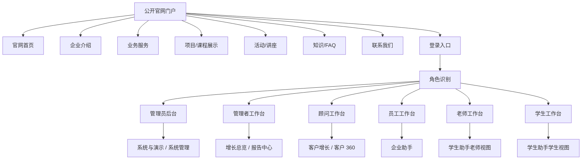

# 企业官网门户与角色工作台前端信息架构设计

## 1. 背景

当前项目已经从一期“客户增长闭环 demo”扩展为二期“完整教育服务业务系统”。此前已确认登录后的后台应采用“客户增长流水线 + 客户 360 工作台”结构，避免把 CRM、企业助手、学生助手、系统管理等能力平铺成一个拥挤工作台。

本次进一步确认：系统的第一入口不应该直接是后台工作台，而应该先是一个无需登录的企业官网门户。官网用于面向陌生游客、潜在客户、家长、学生和合作方展示企业背景、业务服务、项目活动和咨询入口；登录页连接官网与后台；登录后再按角色进入不同的生产力工作台。

因此，后续前端按三层产品结构推进：

```text
公开官网门户 -> 登录 / 角色识别 -> 登录后后台生产力工具
```

## 2. 产品定位

系统不再按答辩演示入口设计，而是按真实企业级落地使用设计。

外部教育服务官网只作为信息组织参考，不做视觉或内容复刻。对当前项目最有价值的启发是：未登录首页要先让陌生访客理解企业是谁、服务什么人、有什么可信路径、下一步如何咨询；登录后的后台能力只作为内部生产力工具出现。

| 层级 | 用户 | 目标 |
| --- | --- | --- |
| 公开官网门户 | 陌生游客、潜在客户、家长、学生、合作方 | 了解企业、业务、项目、活动和咨询方式 |
| 登录入口 | 员工、顾问、老师、学生、管理员、管理者 | 身份进入后台系统 |
| 后台生产力工具 | 内部运营角色和学生用户 | 完成客户增长、学生服务、企业协同、报告和系统治理 |

公开官网不展示内部 CRM、审计日志、系统管理、员工日报、学生风险明细等后台数据。后台能力必须在登录后按角色展示。

## 3. 总体信息架构



## 4. 公开官网门户

### 4.1 目标

公开官网门户负责获客和信任建立，不承担内部运营管理。

它需要回答：

1. 这家公司是谁。
2. 提供哪些教育服务。
3. 面向哪些学生或客户。
4. 有哪些项目、课程、活动和成功路径。
5. 如何咨询、报名或登录。

官网第一屏的优先级：

1. 企业定位和服务对象清晰。
2. 核心服务和热门项目可快速理解。
3. 近期活动、FAQ 和联系方式能承接咨询。
4. “立即咨询 / 查看项目 / 活动报名”和“登录后台”是不同动作，不混在一起。

### 4.2 页面结构

| 页面 | 内容 | 主要动作 |
| --- | --- | --- |
| 官网首页 | 企业定位、核心服务、信任背书、项目入口、活动入口、FAQ 摘要、咨询 CTA | 立即咨询、查看项目、活动报名、登录后台 |
| 企业介绍 | 公司背景、服务理念、团队/资质、业务覆盖 | 联系顾问 |
| 业务服务 | 留学规划、国际本科、德国双元制、语言培训、背景提升、学生服务 | 查看对应项目 |
| 项目/课程展示 | 对外可见项目介绍、适合人群、费用区间、周期、咨询入口 | 咨询项目、报名活动 |
| 活动/讲座 | 对外活动列表、时间、地点、适合对象、报名入口 | 报名活动 |
| 知识/FAQ | 公司业务、留学政策、常见问题，支持 Dify/fallback | 提问、查看答案 |
| 联系我们 | 电话、微信、地址、咨询表单 | 提交咨询 |
| 登录 | 账号、密码、角色提示、演示账号入口 | 登录并进入角色工作台 |

### 4.3 官网边界

官网可以使用公开展示数据和部分已有接口，但不能暴露内部运营数据。

官网内容表达要从游客视角出发，把后台能力翻译成服务结果。例如“画像研判”和“推荐规则”在官网中表达为“规划评估”和“项目匹配建议”，不要把内部字段、评分和工作流直接暴露给游客。

允许展示：

- 企业介绍和业务服务文案。
- 公开项目/课程摘要。
- 公开活动/讲座信息。
- 知识/FAQ 问答。
- 咨询表单或活动报名入口。

禁止展示：

- CRM 客户列表。
- 客户 360。
- 员工日报。
- 学生心理预警明细。
- 审计日志。
- 角色权限矩阵。
- OpenAPI、seed、接口健康等演示控制。

## 5. 登录入口与角色跳转

### 5.1 当前阶段策略

当前阶段先实现“前端登录页 + 角色跳转”的产品闭环，不把它伪装成完整生产认证。

第一版可采用演示账号或角色选择进入对应后台；V2 再补真实登录、Token、后端权限校验和会话管理。

### 5.2 跳转规则

| 角色 | 登录后默认入口 | 说明 |
| --- | --- | --- |
| 管理员 | 系统与演示 / 系统管理 | 管理用户、角色、权限、审计、通知和演示控制 |
| 管理者 | 增长总览 | 查看经营状态、客户漏斗、报告和风险 |
| 顾问 | 客户增长 | 管理客户列表、客户 360、跟进、任务、活动报名 |
| 员工 | 企业助手 | 用自然语言完成客户录入、日报、组织架构、新人指南和受控查询 |
| 老师 | 学生助手老师视图 | 审批请假、处理反馈、跟进心理辅助预警、查看学生进度 |
| 学生 | 学生助手学生视图 | 请假、反馈、查进度、查学业节点和生活支持问答 |

### 5.3 权限展示规则

1. 未登录用户只能访问官网门户和登录页。
2. 登录后按角色显示后台一级入口。
3. 无权限一级入口直接隐藏。
4. 页面内无权限动作显示禁用或只读状态。
5. 系统管理页展示角色-权限点矩阵，说明当前权限模型。
6. 当前阶段前端权限用于体验演示；生产级接口权限属于 V2 增强。

## 6. 登录后后台生产力工具

登录后后台沿用“客户增长流水线 + 客户 360 工作台”结构，但它属于第二层应用，不是系统第一屏。

后台一级入口：

| 入口 | 主要角色 | 定位 |
| --- | --- | --- |
| 增长总览 | 管理者、顾问、管理员 | 今日重点、最近客户、待办、经营状态 |
| 客户增长 | 顾问、管理者、管理员 | CRM 流水线、客户列表、阶段推进 |
| 客户 360 | 顾问、管理者、管理员 | 单个客户的画像、推荐、咨询、跟进、活动、报告 |
| 运营资源 | 顾问、运营、管理员 | 项目/课程、活动、知识库 |
| 报告中心 | 管理者、管理员、老师 | 客户经营、员工日报、学生心理、投诉处理报告 |
| 二期助手 | 员工、老师、学生、管理员 | 企业助手、学生助手 |
| 系统与演示 | 管理员、部分管理者只读 | 用户角色、权限、审计、通知、OpenAPI、seed、fallback |

### 6.1 客户增长与客户 360

客户增长主链路保持为后台核心：

```text
客户进入系统 -> 画像研判 -> 项目推荐 -> Dify 咨询 -> CRM 跟进 -> 活动报名 -> 报告快照
```

客户 360 内部 tabs：

1. 客户概览。
2. 画像研判。
3. 推荐项目。
4. 咨询记录。
5. 跟进任务。
6. 活动报名。
7. 报告快照。

右侧 AI 建议 / 下一步动作只在客户 360 内按需出现，并可收起。

### 6.2 二期助手

二期助手不再抢占后台首屏，但登录后按角色可直接进入。

企业助手：

- 客户自然语言录入。
- 客户查询。
- 状态更新。
- 口述日报。
- 日报汇总。
- 组织架构。
- 新人指南。
- 受控 NL2SQL。

学生助手：

- 请假申请与审批。
- 售后反馈。
- 学业考务。
- 申请进度。
- 生活支持。
- 心理辅助预警。
- 二次转化推荐。

学生心理相关文案必须表达为辅助识别，不得替代专业心理诊断。

## 7. 实施优先级

新版前端实施顺序：

1. 建立公开官网门户壳层，并先形成“可信企业 + 核心服务 + 咨询转化”的第一屏。
2. 建立登录页和角色跳转。
3. 建立登录后后台壳层。
4. 建立客户增长和客户 360。
5. 收纳运营资源。
6. 收纳二期助手。
7. 建立系统与演示。
8. 后续 V2 补真实认证、Token、后端权限校验、数据库迁移和部署运维。

## 8. V2 兼容边界

当前阶段要按真实企业级产品结构设计，但不要求一次性完成生产级认证和部署。

V1 应完成：

- 官网门户可访问。
- 登录页可进入角色工作台。
- 后台 IA 正确。
- 客户增长主链路可演示。
- 二期助手和系统治理入口清晰。

V2 再补：

- 真实账号登录。
- Token 和会话管理。
- 后端权限校验。
- 数据库迁移工具。
- 公开内容后台维护。
- 生产环境部署、日志、监控和 CI。

## 9. 非目标

本阶段不做：

1. 不一次性实现完整生产认证。
2. 不把官网做成营销空壳，官网必须能承载真实企业介绍、业务服务和咨询入口。
3. 不把后台工作台暴露为未登录首屏。
4. 不在官网展示内部运营数据。
5. 不为了答辩演示把 OpenAPI、seed、fallback 等开发控件放到公开首页。
